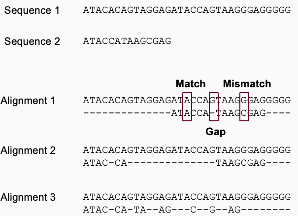
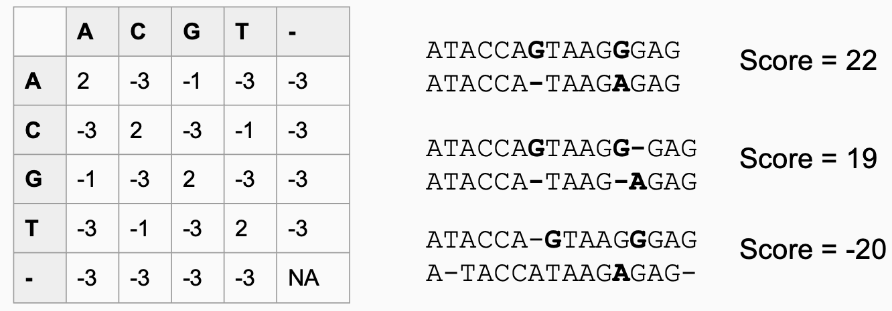
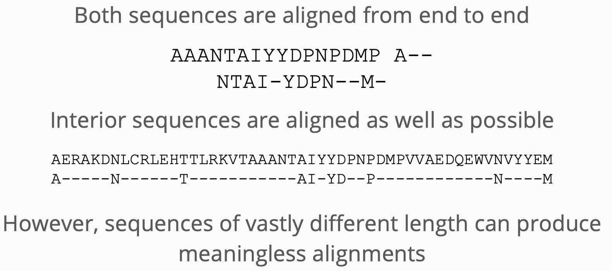
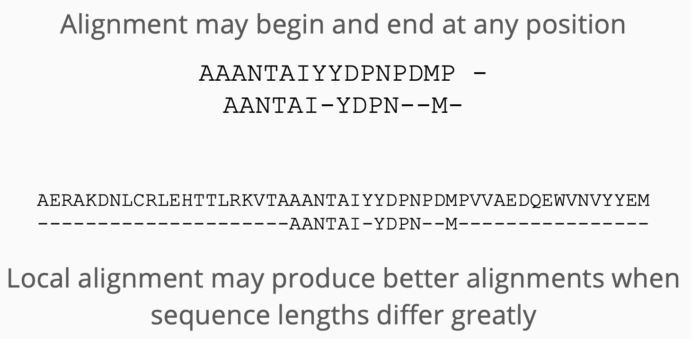
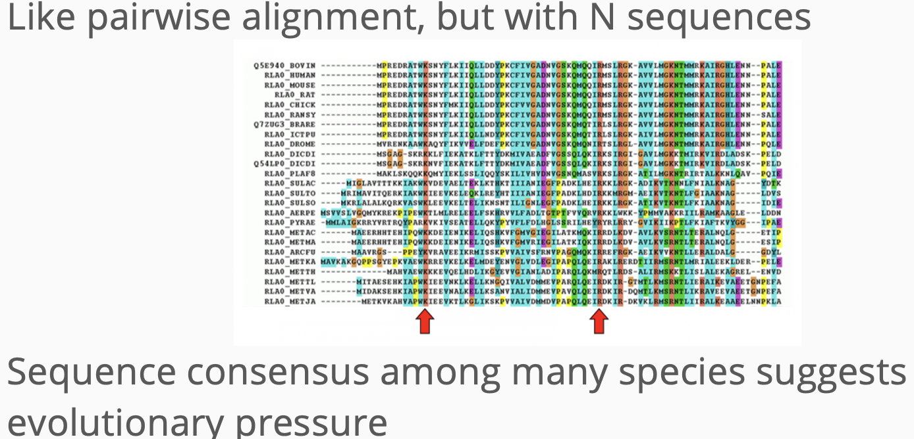
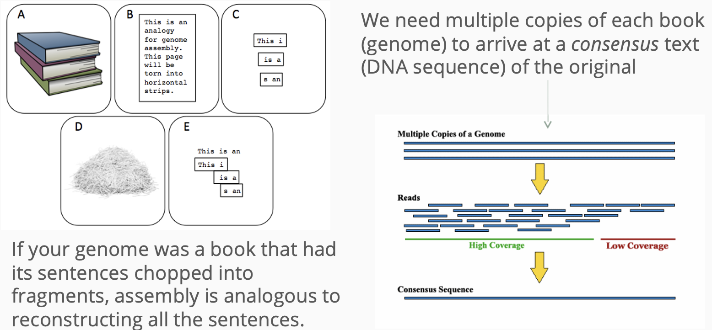
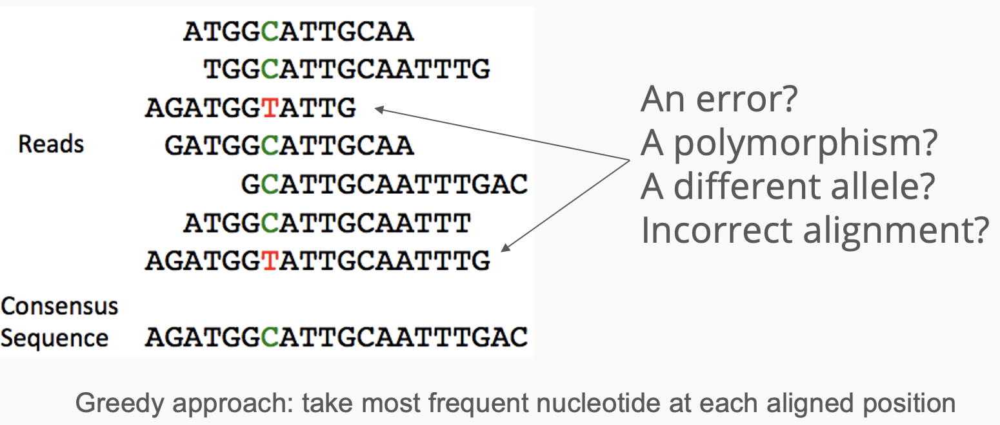
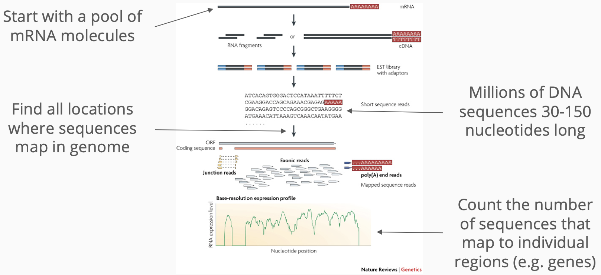
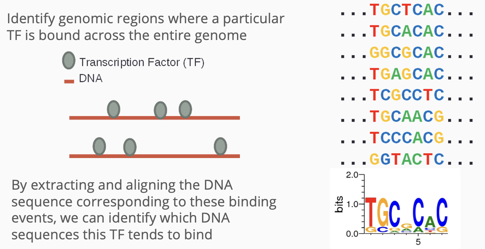

# Sequence Alignment

## Sequence Alignment
\Large
- Provides a measure of relatedness
- Alignment quantified by similarity (% identity)
- Useful for any sequential data type:
  - DNA/RNA
  - Amino acids
  - Protein secondary structure
- High sequence similarity might imply:
  - Common evolutionary history
- Similar biological function

## What Alignments Can Tell Us

\Large
- Homology - Orthologs, Paralogs
- Genomic identity/origin of a sequence/individual
- Genome/gene structure
- Genic structure (exons, introns, etc)
  - RNA 2D structure
  - Chromosome rearrangements/3D structure


## DNA Sequence Alignment Example
\center
{height=70%}


## Scoring/Substitution Matrices

\Large
- Given alignment, how “good” is it?
- Higher score = better alignment
- Implicitly represent evolutionary patterns

{height=70%}

## Sequence Alignment Algorithms

\Large 
- **Global** alignments - beginning and end of both sequences must align
- **Local** alignments - one sequence may align anywhere within the other
- Multiplicity:
  - Pairwise alignments (2 sequences)
  - Multiple sequence alignment (3+ sequences)

## Global Alignment


## Local Alignment


## Multiple Sequence Alignment


## Methods for Multiple Sequence Aligment (MSA)
\Large
1. **Progressive Alignment Algorithms**:
   - *ClustalW*: A widely used progressive alignment tool with a guide tree strategy.
   - *Clustal Omega*: An enhanced version of ClustalW with improved speed and accuracy.

2. **Iterative Alignment Algorithms**:
   - *MAFFT (Multiple Alignment using Fast Fourier Transform)*: Uses iterative refinement with consistency scores.
   - *MUSCLE (Multiple Sequence Comparison by Log-Expectation)*: Utilizes progressive alignment followed by iterative refinement.

## Methods for MSA (Continued)
\Large
3. **Hidden Markov Models (HMMs)**:
   - *HMMER*: Based on HMMs, used for alignment and homology detection.
   - *SAM (Sequence Alignment and Modeling System)*: Combines HMMs with profiles for database searches.

4. **Probabilistic Alignment Methods**:
   - *ProbCons*: Generates a probabilistic alignment using a Bayesian framework.
   - *PRANK*: Considers sequence and alignment uncertainty in alignment generation.

## Methods for MSA (Continued)
\Large
5. **Structure-Based Alignment**:
   - *MUSTANG (Multiple Structural Alignment by Secondary Structures)*: Aligns based on protein structures considering sequence and structure.
   - *DALI (Distance Alignment Matrix Method)*: Aligns sequences based on structural similarity.

These methods vary in their approaches and are chosen based on factors such as alignment accuracy, computational efficiency, and the characteristics of the input sequences.

## ClustalW: A Common MSA Tool

\Large
- ClustalW is one of the most widely used tools for multiple sequence alignment.
- It uses a progressive alignment approach.
- Available as standalone software or through [a web server](https://www.genome.jp/tools-bin/clustalw).

## Example: Aligning TB genomes
\Large
Download the following TB genomes:

  - [H37Rv](https://www.ncbi.nlm.nih.gov/nuccore/NC_000962.3?report=fasta)
  - [Mycobacterium tuberculosis str. Erdman](https://www.ncbi.nlm.nih.gov/nuccore/AP012340.1?report=fasta)
  - Combine into single FASTA, first 100 lines: 

\normalsize
```{bash, eval=F}
{ head -101 sequence.fasta; head -101 sequence-2.fasta; } \
> combined.fasta
```

\Large
  - Analyze using [ClustalW](https://www.genome.jp/tools-bin/clustalw)


## Example: Genome Assembly


## Example: Genome Assembly


## Example: mRNA-Seq Analysis


## Example: DNA Binding Site Discovery
\center
{height=70%}
## Session info
\tiny
```{r session info}
sessionInfo()
```

