# Biological Databases and resources

##

\begin{center}
\includegraphics[width=4.5in]{dbFigs/bigdata.png}
\end{center}

Big Data has fundamentally changed how we look at science and business. Along with advances in analytic methods, they are providing unparalleled insights into our physical world and society

## Structured vs. Unstructured data
\includegraphics[width=4.75in]{dbFigs/data_collage.png}

## Biology Is A Data Science

\Large
- Hundreds of thousand of species
- Million of articles in scientific literature
- Genetic Information
  - Gene names
  - Phenotype of mutants 
  - Location of genes/mutations on chromosomes
  - Linkage (relationships between genes)

## Data and Metadata

\Large
- Data are “concrete” objects
  - e.g. number, tweet, nucleotide sequence
- Metadata describes properties of data
  - e.g. object is a number, each tweet has an author
- Database structure may contain metadata
  - Type of object (integer, float, string, etc)
  - Size of object (strings at most 4 characters long)
  - Relationships between data (chromosomes have zero or more genes) 

## What is a Database?

\Large
- A data collection that needs to be :
  - Organized
  - Searchable
  - Up-to-date
- Challenge: 
  - Change “meaningless” data into useful, accessible information


## A spreadsheet can be a Database
\begin{columns}
	\begin{column}{0.35\textwidth}
{
  \large
  A spreadsheet contains:
  \begin{itemize}
    \item Rectangular data
    \item Structured
    \item No metadata
  \end{itemize}
Search tools:
\begin{itemize}
    \item Excel
    \item grep
    \item python/R
  \end{itemize}
}
	\end{column}
	
	\begin{column}{0.65\textwidth}
	\center
	\includegraphics[width=3in]{dbFigs/table.png}
	\end{column}
\end{columns}


## A filesystem can be a Database
\begin{columns}
	\begin{column}{0.35\textwidth}
{
  \Large
  Hierarchical data:
  \begin{itemize}
    \item Some metadata: File, symlink, etc
    \item Unstructured
  \end{itemize}
Search tools:
\begin{itemize}
    \item ls
    \item find
    \item grep
  \end{itemize}
}
	\end{column}
	
	\begin{column}{0.65\textwidth}
	\center
	\includegraphics[width=3in]{dbFigs/filesystem.png}
	\end{column}
\end{columns}


## Organization and Types of Databases
\begin{columns}
	\begin{column}{0.5\textwidth}
	\center
	\includegraphics[width=2in]{dbFigs/organize1.png}
	\end{column}
	
	\begin{column}{0.5\textwidth}
	\center
	\includegraphics[width=2.25in]{dbFigs/organize2.png}
	\end{column}
\end{columns}


## Organization and Types of Databases

Every database has tools that: Store, Extract, Modify

Flat file databases (flat DBMS)
  
- Simple, restrictive, table

Hierarchical databases
  
- Simple, restrictive, tables

Relational databases (RDBMS)

- Complex, versatile, tables

Object-oriented databases (ODBMS)

- Data warehouses and distributed databases

Unstructured databases (object store DBs)

## Where do the data come from?
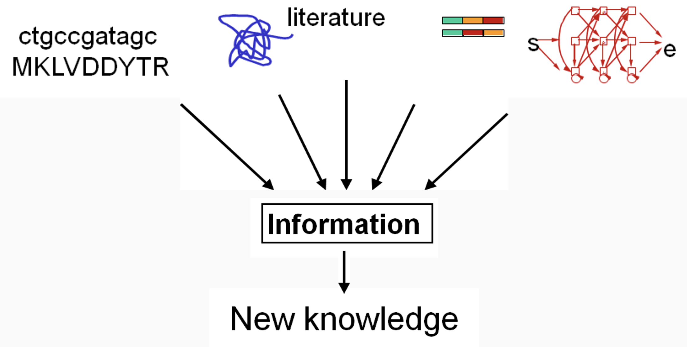

## Using biomedical data
{height=88%}

## Using biomedical data
{height=85%}

## Types of Biological Data

Primary data types (observed properties):

- Molecular Sequence: nucleic or amino acids
- Quantity: DNA, RNA, Protein, cell count, metabolites
- Locality: membrane, nucleus, epithelium
- Structure: 3D conformation, proximity, size

Secondary data types (inferred properties):

- Molecular Function
- Dynamics
- Relation: multiplicity, distribution, binding
- Association: co-occurrence, correlation
- Predicted: computational models

## Types of Biological Databases
Primary Databases:

- Original submissions by experimentalists
- Content controlled by the submitter
- Examples: GenBank, Trace, SRA, SNP, GEO

Secondary databases: 

- Results of analysis of primary databases
- Aggregate of many databases
- Content controlled by third party (NCBI)
- Examples: NCBI Protein, Refseq, RefSNP, GEO datasets, UniGene, Homologene, Structure, Conserved Domain

## The NCBI hosts more than 50 different tools and databases
\Large
National Center for Biotechnology Information (NCBI): 

- **PubMed** - search for citations/papers
- **BLAST** - search for sequences
- **Nucleotide** - all nucleotide sequences (DNA, etc)
- **Genome** - published genomes
- **Protein** - amino acid sequences
- **SNP (dbSNP)** - all human SNPs
- **dbGAP** - Controlled access datasets

## International Sequence Database Collaboration 
\center
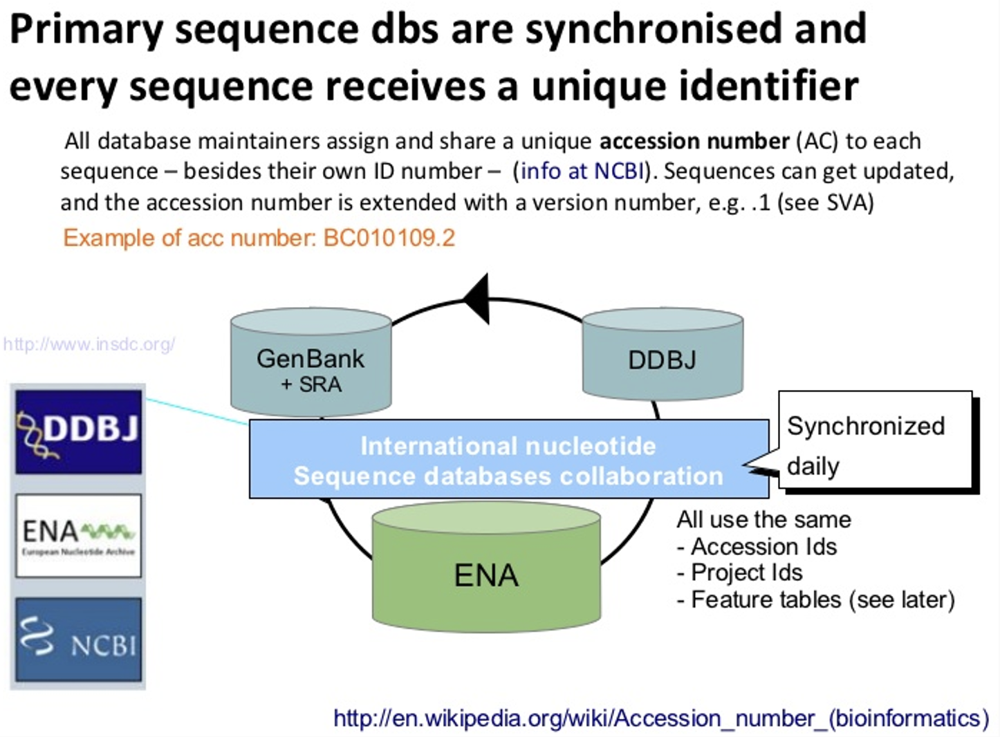{width=60%}

- [International Sequence Database Collaboration](http://www.insdc.org/)
- [National Centre for Biotechnology Information (NCBI)](https://www.ncbi.nlm.nih.gov/)
- [European Nucleotide Archive (ENA)](https://www.ebi.ac.uk/ena)
- [DNA Data Bank of Japan (DDBJ)](http://www.ddbj.nig.ac.jp/)


## PubMed is a search engine for literature
\Large
- Citation/publication databases
- Medline: https://www.nlm.nih.gov/bsd/pmresources.html 
  - NLM journal citation database.
  - Includes citations 5,600 scholarly journals
- PubMed https://www.ncbi.nlm.nih.gov/pubmed/
  - Includes MEDLINE
  - journals/manuscripts deposited in PMC
  - NCBI Bookshelf

## Searching PubMed with MeSH terms

\large
**MeSH (Medical Subject Headings)** is the NLM controlled vocabulary used for indexing articles for PubMed.

- the U.S. National Library of Medicine's controlled vocabulary
- arranged in a hierarchical manner called the MeSH Tree Structures
updated annually

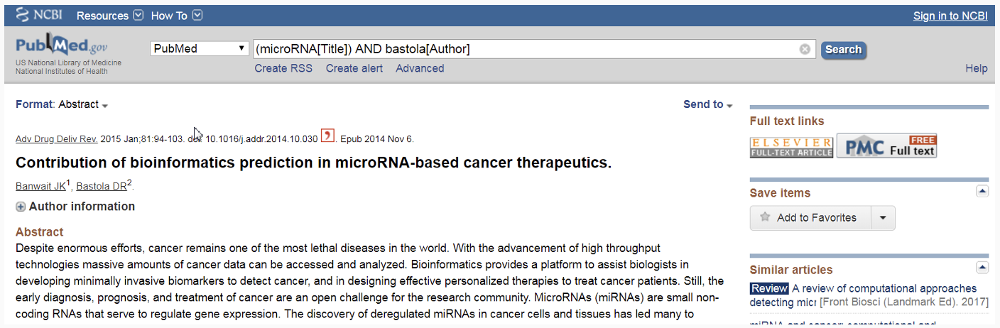


## Google Scholar
[Google Scholar](https://scholar.google.com) is another alternative for finding publications:

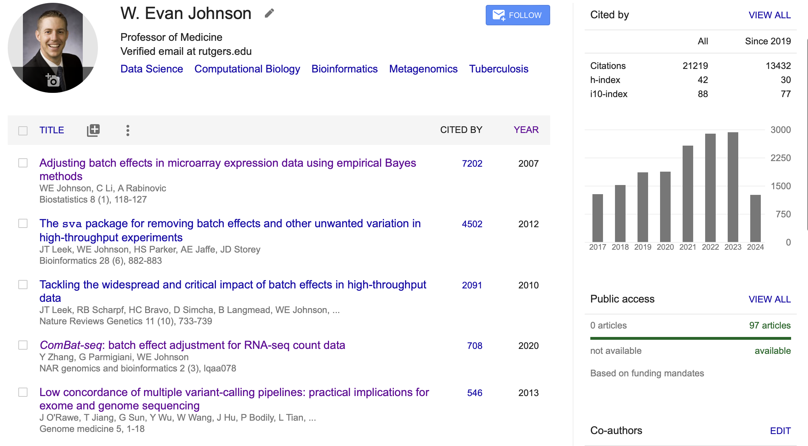


# Collections of DNA/RNA sequences

## GenBank is an annotated collection of all publicly available DNA sequences 

\Large 
GenBank: https://www.ncbi.nlm.nih.gov/genbank/ 

  - Flat file
  - DNA only sequence database
  - Archival in nature: Historical, Redundant
  - Sample GenBank record (accession number U49845)
    - NCBI: https://www.ncbi.nlm.nih.gov/nuccore/U49845
    - ENA: https://www.ebi.ac.uk/ena/data/view/U49845 
    - DDBJ: http://getentry.ddbj.nig.ac.jp/top-e.html


## GenBank Flat File
\center 
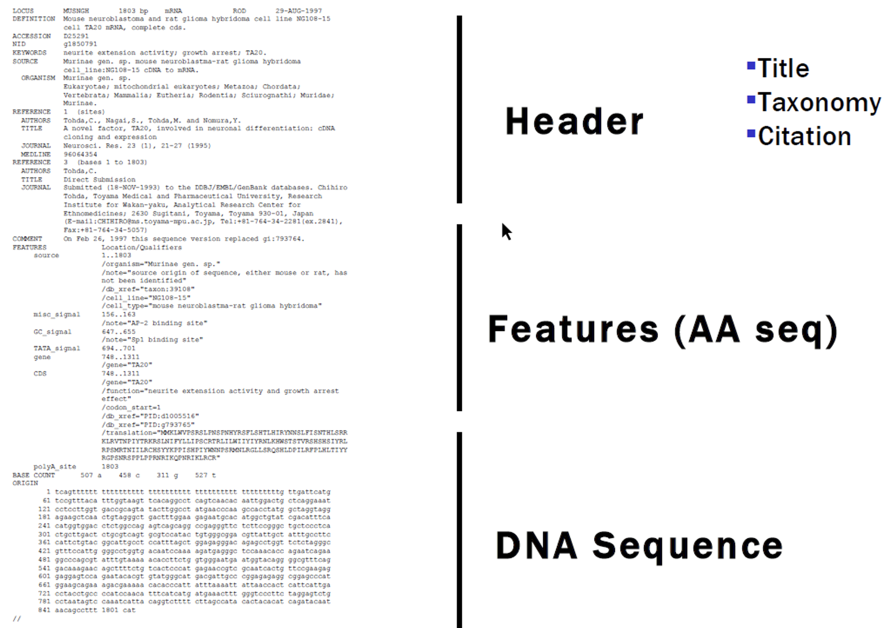{height=90%}

## Ensembl (European Bioinformatics Institute)

\begin{columns}
	\begin{column}{0.4\textwidth}
{
\begin{itemize}
  \item Comprehensive DNA/RNA sequence and annotation database
  \item Ensembl annotate genes, computes multiple alignments, predicts regulatory function and collects disease data
  \item Analysis tools:
  \begin{itemize}
    \item BLAST
    \item BioMart
    \item Variant Effect Predictor
  \end{itemize}
\end{itemize}
}
	\end{column}
	
	\begin{column}{0.6\textwidth}
	\center
	\includegraphics[width=2.5in]{dbFigs/ensembl.png}
	\end{column}
\end{columns}

# Databases for reference sequences

## Reference genomes
\Large
- NCBI Genome - https://www.ncbi.nlm.nih.gov/datasets/genome/
  - Contains both Genbank and Refseq accessions
- Ensembl - https://useast.ensembl.org/index.html

## microRNAs

\Large
- miRbase: [https://mirbase.org](https://mirbase.org) allows you to search and browse miRNAs from a host of species
- Enables download of genomic coordinates for miRNAs (.gff) and sequence (.fa)

## rRNAs and tRNAs databases

\Large
- rRNAs
 - Greengenes - https://greengenes.secondgenome.com
  - Silva - https://www.arb-silva.de
- tRNAs
  - gtRNAdb- http://gtrnadb.ucsc.edu
  

## Species-specific databases
\Large
For other well studied model organisms, you can often find collections of resources and tools:

- Flybase - D. melanogaster
- Wormbase - C. elegans
- Zfin - D. rerio
- [Influenza (link!)](https://www.ncbi.nlm.nih.gov/genomes/FLU/Database/nph-select.cgi?go=database)


## RNACentral

\begin{columns}
	\begin{column}{0.65\textwidth}
\center
	\includegraphics[width=3in]{dbFigs/rnacentral.png}
	\end{column}
	
	\begin{column}{0.35\textwidth}
	{\begin{itemize}
	  \item Developed by EBI and Wellcome Trust
	  \item Integration of many other up-to-date RNA resources and tools 
	 
	 \end{itemize}
}
	\end{column}
\end{columns}
\center 

[Click here for an overview of core functions](https://www.youtube.com/watch?v=oqUBhQPPzZs)

## Existing datasets -- sequencing data (SRA or GEO)

## dbGaP: genotype-phenotype interactions in humans

\Large
- Most studies contain PHI and are subject to strict access control and usage regulations
- Applications required to be granted access to datasets
- Any data with sensitive health information must be stored, handled, and interacted with according to appropriate regulations

\Large
**SRA - Sequencing Read Archive** 

- Raw sequencing data and alignment info
- Metagenomics, environmental samples, biomedical sequencing

Download via:

- SRA-toolkit
- FTP links on EMBL ENA

## A quick demonstration of SRA-toolkit and EMBL-ENA

\Large
- SRA-toolkit is the official tool released by NCBI to directly download SRA files
  - Notorious for being obtuse to use and confusing commands / documentation
- EMBL-ENA hosts FTP links directly
  - Most but not all SRA accessions available
  - Have to use wget, curl, or other methods to download

## A quick demonstration of SRA-toolkit

[Download a file for an asthma host microbiome dataset](https://pubmed.ncbi.nlm.nih.gov/26277095/)

```{bash, eval=F}
## attach the sratoolkit
module load sratoolkit

## Save accession to download
acc = "SRR1528344"

## Download using fastq-dump 
fastq-dump $acc
# option --split-3 is needed for paired end reads

## don't forget to compress the file!
gzip $acc.fastq
```

## A quick demonstration of SRA-toolkit

[Download all files for an asthma host microbiome dataset](https://pubmed.ncbi.nlm.nih.gov/26277095/)
```{bash, eval=F}
accs=( $( cat SRR_Acc_List.txt ) )
for i in $(seq 0 ${#accs[@]}) 
do 
	fastq-dump ${a[i]};
	gzip ${a[i]}*
done
```

## Batch script (SLURM)

\small
```{bash, eval=F}
#!/bin/bash
#SBATCH --job-name=microbiome_download
#SBATCH --mem=1G
#SBATCH --time=01:00:00

module load sratoolkit
cd $HOME/tmp/

accs=( $( cat SRR_Acc_List.txt ) )
for i in $(seq 0 ${#accs[@]}) 
do 
	fastq-dump ${a[i]};
	gzip ${a[i]}*
done
```
Save as a file and use `sbatch` to submit

## Batch array (SLURM)

\footnotesize
```{bash, eval=F}
#!/bin/bash
#SBATCH --job-name=microbiome_download
#SBATCH --output=asthma.out
#SBATCH --array=0-27
#SBATCH --cpus-per-task=1
#SBATCH --mem=1G
#SBATCH --time=00:20:00

module load sratoolkit
cd /scratch/$USER
  
accs=( $( cat SRR_Acc_List.txt ) )
acc_number=${accs[$SLURM_ARRAY_TASK_ID]}

fastq-dump --gzip $acc_number
```

Save as a file and use `sbatch` to submit

## Gene Expression Data

\Large
**GEO - Genome Expression Omnibus**

- Tied to SRA via Bioproject ID
- GEO also contains processed data, typically specific to a publication
- You may find: Alignments (BAM/SAM), visualizations (.bg, .bed) and intermediate results (delimited formats)


## GEOquery example 

```{r, eval=F}
# Load the geoquery library
# BiocManager::install("GEOquery")
library(GEOquery)

# Search for a dataset in GEO
geo_search <- getGEO("GSE1297", GSEMatrix = TRUE)

# Display basic information about the dataset
print(geo_search)

# Extract expression data
expression_data <- exprs(geo_search[[1]])

# Display the first few rows of expression data
head(expression_data)
```

# Domain-specific data

## TCGA / NCI Genomic Data Commons
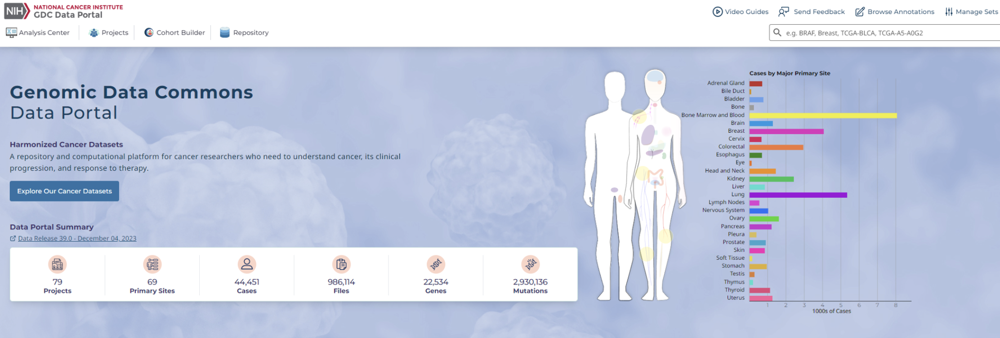
\center
https://portal.gdc.cancer.gov

## Tissue-specific gene expression
GTex collects tissue-specific gene expression from primarily healthy individuals
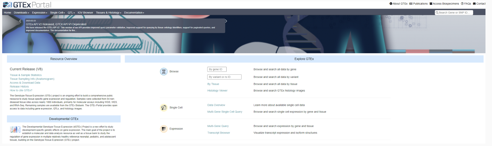
\center 
https://www.gtexportal.org/home/

## DNA regulatory elements
ENCODE contains a host of information about DNA regulatory elements
\center 
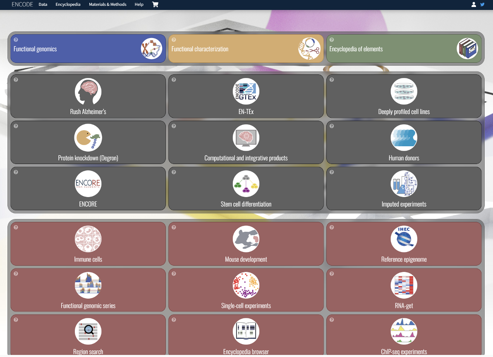{height=70%}
https://www.encodeproject.org

# Protein databases

## NCBI Protein
Protein sequence database: https://www.ncbi.nlm.nih.gov/protein/ 
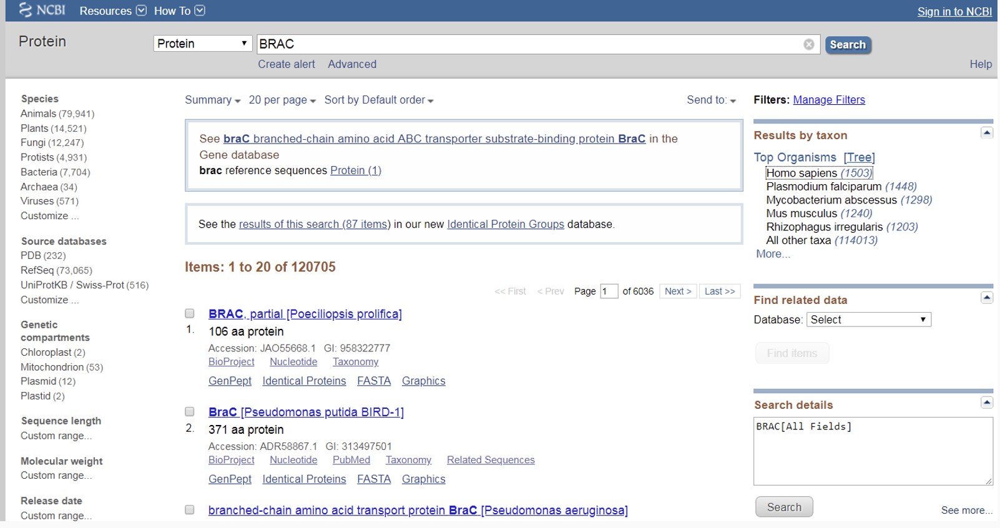

## Genpept 
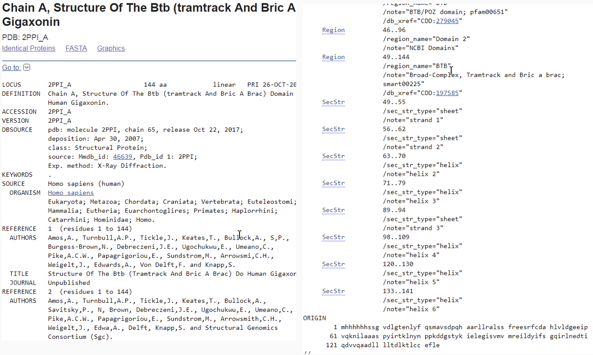

## Uniprot

\begin{columns}
	\begin{column}{0.5\textwidth}
{
\begin{itemize}
  \item The Universal Protein Resource
  \item Comprehensive resource for protein sequence and annotation data
  \item Collaboration between:
  \begin{itemize}
    \item EMBL-EBI
    \item Swiss Institute of Bioinformatics
    \item Protein Information Resource
  \end{itemize}
  \item Entries in two categories:
  \begin{itemize}
    \item Swiss-Prot (experimentally verified)
    \item TrEMBL (computer-annotated)
  \end{itemize}
  \item http://www.uniprot.org/ 
\end{itemize}
}
	\end{column}
	
	\begin{column}{0.5\textwidth}
	\center
	\includegraphics[width=2.5in]{dbFigs/uniprot.png}
	\end{column}
\end{columns}

## Protein Structure database - PDB

\begin{columns}
	\begin{column}{0.45\textwidth}
{
\begin{itemize}
  \item Protein Data Bank (PDB)  http://www.rcsb.org/ 
  \item Dedicated to 3D structure of proteins and peptides
  \item $\sim$150,000 predicted and experimental (solved) structures
  \end{itemize}
}
	\end{column}
	
	\begin{column}{0.55\textwidth}
	\center
	\includegraphics[width=2.5in]{dbFigs/pdb.png}
	\end{column}
\end{columns}

## PDB: kinesin 6
\center
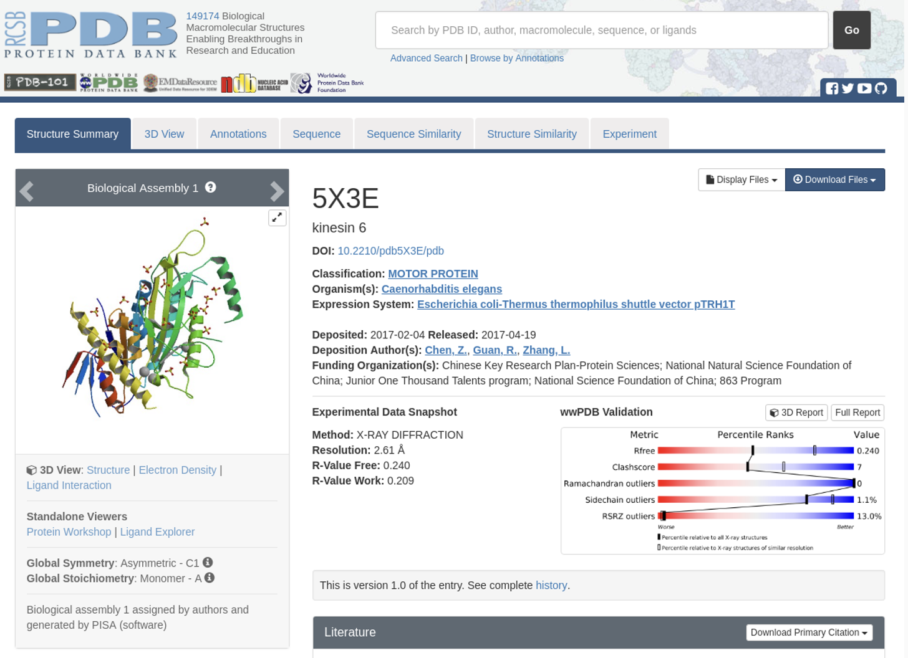{height=90%}

## Protein Family Database	
- http://pfam.xfam.org/family/piwi 
- Pfam is a database of protein families that includes their annotations and multiple sequence alignments generated using Hidden Markov Models 

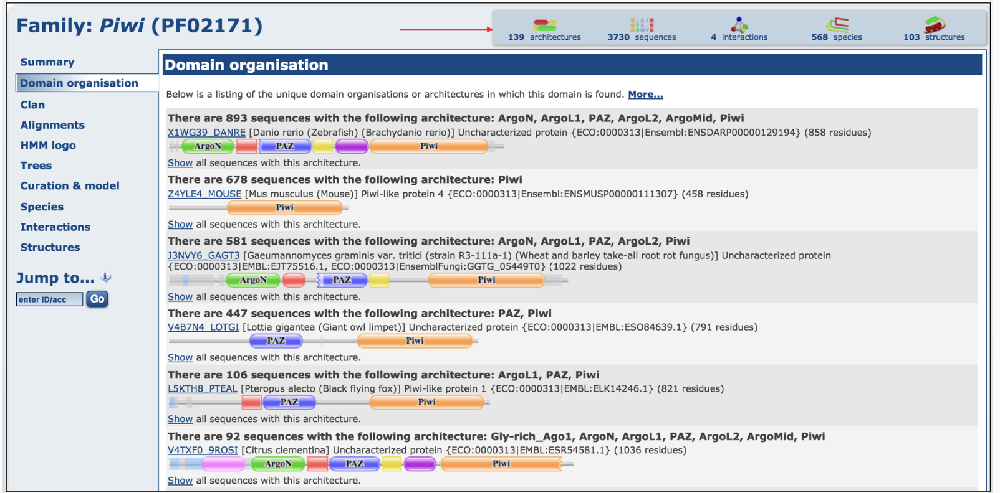

## Protein-Protein Interaction Database
\begin{columns}
	\begin{column}{0.5\textwidth}
{
\begin{itemize}
  \item STRING:  https://string-db.org/ 
  \item Search Tool for the Retrieval of Interacting Genes/Proteins
  \item Database of protein/protein interactions
  \item Information from numerous sources:
  \begin{itemize}
    \item experimental data
    \item computational prediction methods
    \item public text collections
  \end{itemize}
  \item Expressed as interaction graphs:
  \begin{itemize}
    \item Nodes: Network nodes represent proteins
    \item Edges: Edges represent protein-protein associations
\end{itemize}
  \end{itemize}
}
	\end{column}
	
	\begin{column}{0.5\textwidth}
	\center
	\includegraphics[width=2.25in]{dbFigs/ppid.png}
	\end{column}
\end{columns}


# Curated resources

## Data vs Annotation Database

- RefSeq: curated nonredundant biological sequences https://www.ncbi.nlm.nih.gov/refseq/ 
  - Source: Genbank (INSDC)
  - Annotated: Community collaboration, automated computer, NCBI staff curation
- Advantages of using RefSeq
  - Non-redundancy    
  - Curated, validated
  - Format consistency
  - Distinct accession series
  - Updates to reflect current sequence data and biology

## RefSeq Annotations
\center
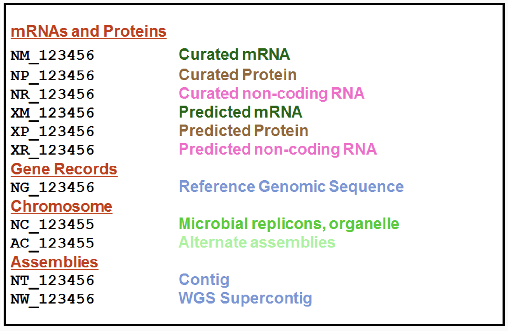{height=90%}


## Avoid using outdated or abandoned tools / databases
\Large
Keep in mind the following:

- Check when it was last updated (ideally recently)
- Check for an associated peer-reviewed publication
- Check for a github repo
  - How recent was the last commit
  - Are they responsive to issues?


## Session info
\tiny
```{r session info}
sessionInfo()
```

