# Sequence Alignment

## Sequence Alignment
\Large
- Provides a measure of relatedness
- Alignment quantified by similarity (% identity)
- Useful for any sequential data type:
  - DNA/RNA
  - Amino acids
  - Protein secondary structure
- High sequence similarity might imply:
  - Common evolutionary history
- Similar biological function

## What Alignments Can Tell Us

\Large
- Homology - Orthologs, Paralogs
- Genomic identity/origin of a sequence/individual
- Genome/gene structure
- Genic structure (exons, introns, etc)
  - RNA 2D structure
  - Chromosome rearrangements/3D structure


## DNA Sequence Alignment Example


## Scoring/Substitution Matrices

\Large
- Given alignment, how “good” is it?
- Higher score = better alignment
- Implicitly represent evolutionary patterns

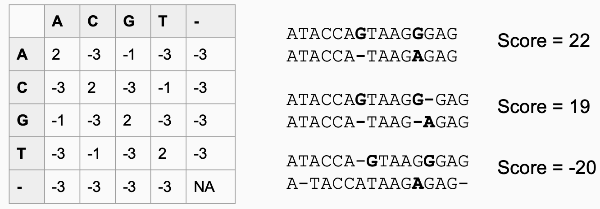

## Sequence Alignment Algorithms

\Large 
- **Global** alignments - beginning and end of both sequences must align
- **Local** alignments - one sequence may align anywhere within the other
- Multiplicity:
  - Pairwise alignments (2 sequences)
  - Multiple sequence alignment (3+ sequences)

## Global Alignment


## Local Alignment
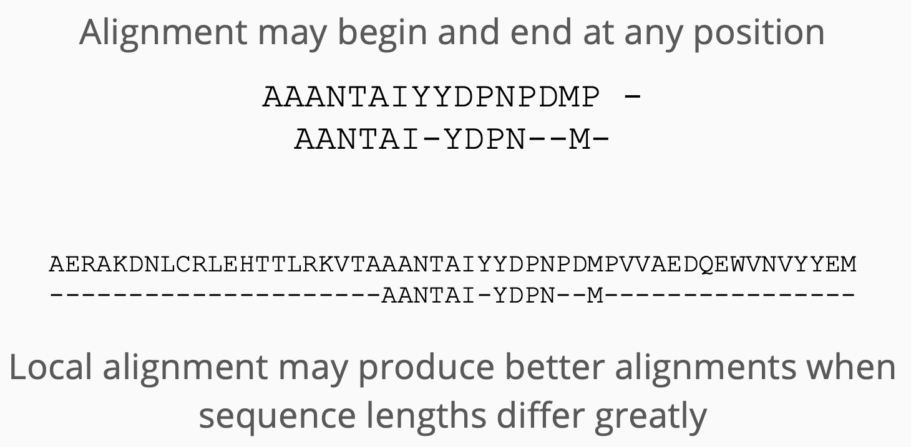

## Multiple Sequence Alignment
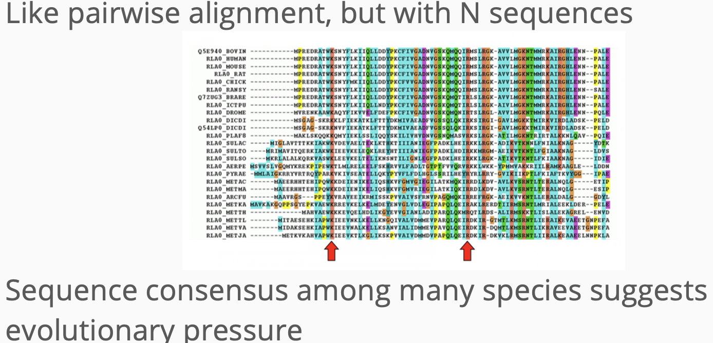

## Methods for Multiple Sequence Aligment (MSA)
1. **Progressive Alignment Algorithms**:
   - *ClustalW*: A widely used progressive alignment tool with a guide tree strategy.
   - *Clustal Omega*: An enhanced version of ClustalW with improved speed and accuracy.

2. **Iterative Alignment Algorithms**:
   - *MAFFT (Multiple Alignment using Fast Fourier Transform)*: Uses iterative refinement with consistency scores.
   - *MUSCLE (Multiple Sequence Comparison by Log-Expectation)*: Utilizes progressive alignment followed by iterative refinement.

3. **Hidden Markov Models (HMMs)**:
   - *HMMER*: Based on HMMs, used for alignment and homology detection.
   - *SAM (Sequence Alignment and Modeling System)*: Combines HMMs with profiles for database searches.

## Methods for MSA (Continued)

4. **Probabilistic Alignment Methods**:
   - *ProbCons*: Generates a probabilistic alignment using a Bayesian framework.
   - *PRANK*: Considers sequence and alignment uncertainty in alignment generation.

5. **Structure-Based Alignment**:
   - *MUSTANG (Multiple Structural Alignment by Secondary Structures)*: Aligns based on protein structures considering sequence and structure.
   - *DALI (Distance Alignment Matrix Method)*: Aligns sequences based on structural similarity.

These methods vary in their approaches and are chosen based on factors such as alignment accuracy, computational efficiency, and the characteristics of the input sequences.

## ClustalW: A Common MSA Tool

\Large
- ClustalW is one of the most widely used tools for multiple sequence alignment.
- It uses a progressive alignment approach.
- Available as standalone software or through [a web server](https://www.genome.jp/tools-bin/clustalw).

## Example: Aligning TB genomes
\Large
Download the following TB genomes:

  - [H37Rv](https://www.ncbi.nlm.nih.gov/nuccore/NC_000962.3?report=fasta)
  - [Mycobacterium tuberculosis str. Erdman](https://www.ncbi.nlm.nih.gov/nuccore/AP012340.1?report=fasta)
  - Combine into single FASTA, first 100 lines: 

\normalsize
```{bash, eval=F}
{ head -101 sequence.fasta; head -101 sequence-2.fasta; } \
> combined.fasta
```

\Large
  - Analyze using [ClustalW](https://www.genome.jp/tools-bin/clustalw)


## Example: Genome Assembly


## Example: Genome Assembly
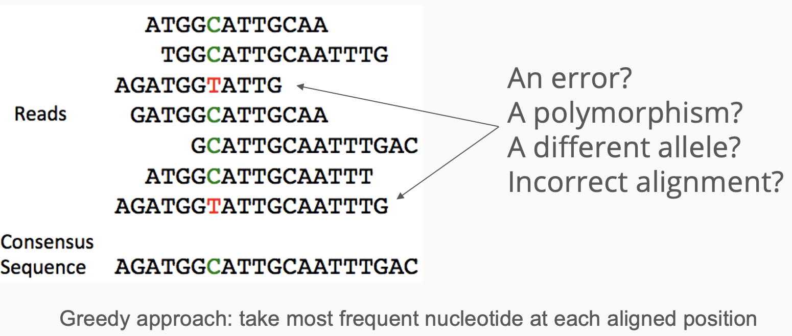

## Example: mRNA-Seq Analysis
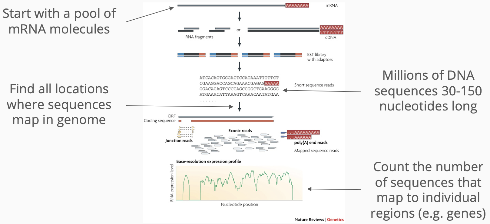

## Example: DNA Binding Site Discovery
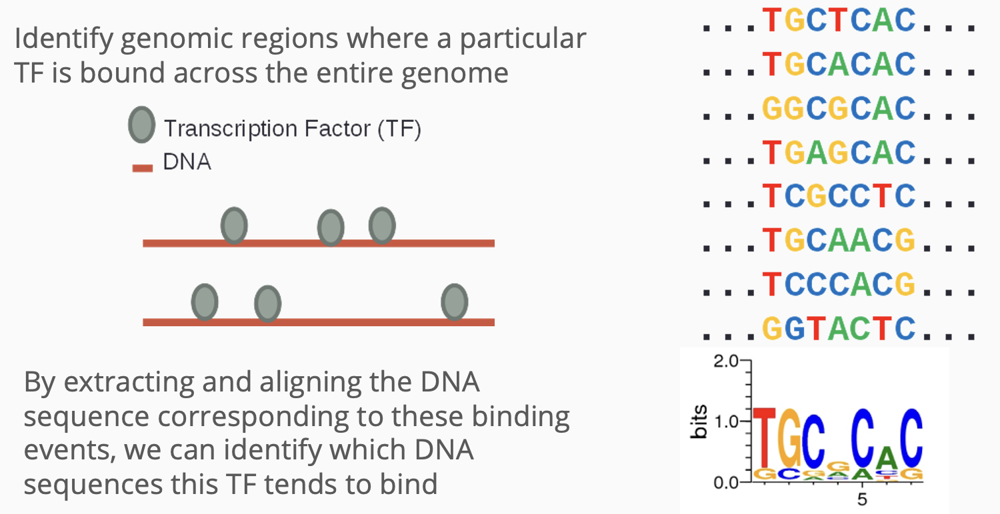


<!--
# Another Motivating Example: 
-->

# Whole Genome/Exome Sequencing

## Whole Genome Sequencing
\Large

- **W**hole **G**enome **S**equencing (WGS)
- Generate enough reads to attain:
  - More than 95% coverage of source genome
  - More than 30x average depth
- Two strategies:
  - De novo: assemble reads into a new sequence
  - Re-sequence: refine an existing reference sequence

## De novo assembly

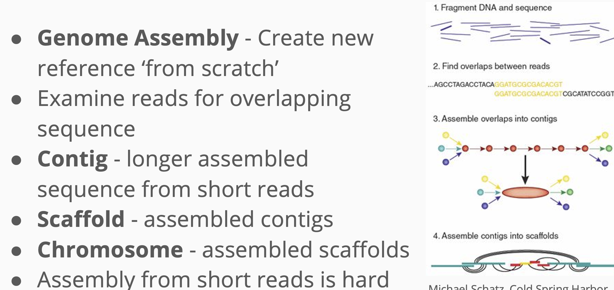


## De novo assembly: graph-based

\Large
- Greedy assembly creates linear sequences
- Vulnerable to finding local optima
- Graph representation considers all sequence content simultaneously
- Graph data structure can encode variability (e.g. insertions, SNPs)
- Computationally much more expensive
- de Brujin Graphs and Overlap Layout Consensus


## De novo assembly: graph-based

\center
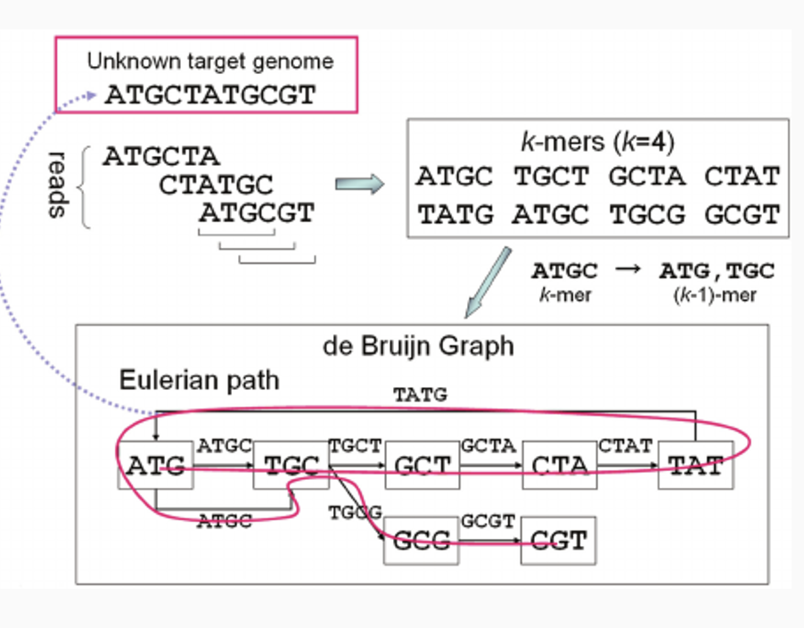{height=80%}

## Reference guided genome assembly

\Large
- Refine existing reference with new sequence
- Can discover:
  - New structural variants
  - Novel insertions/alternate haplotypes or scaffolds
  - Polymorphisms
- Faster, easier than de novo assembly
- More sensitive to existing biases in reference


## Reference guided genome assembly

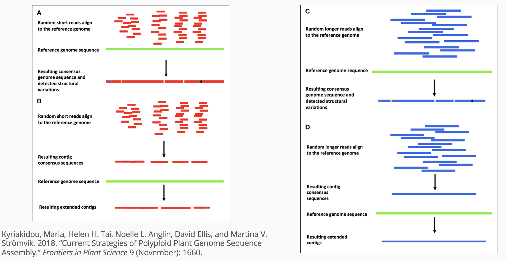

## Whole Exome Sequencing

\Large
- **W**hole **E**xome **S**equencing (WES)
- Exons 1%-2% of human genome sequence
- Pre-select reads that map to exons
- Sequence to much greater depth than WGS
- Identify coding variants

## Exome Sequence Selection

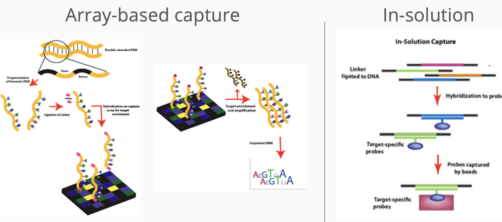

# SNP and Variant Calling

## Genomic Variants

\Large
- Individual genomes from same species vary
- WGS/WES compared with reference can identify differences
- **Variant**: sequence that varies within species
- Two general types:
  - Small: <50 bp, single nucleotide polymorphisms (SNPs), indels
  - Large: >50 bp, copy number variations, duplications, deletions, translocations, inversions

## Genomic Variants


## Point mutations
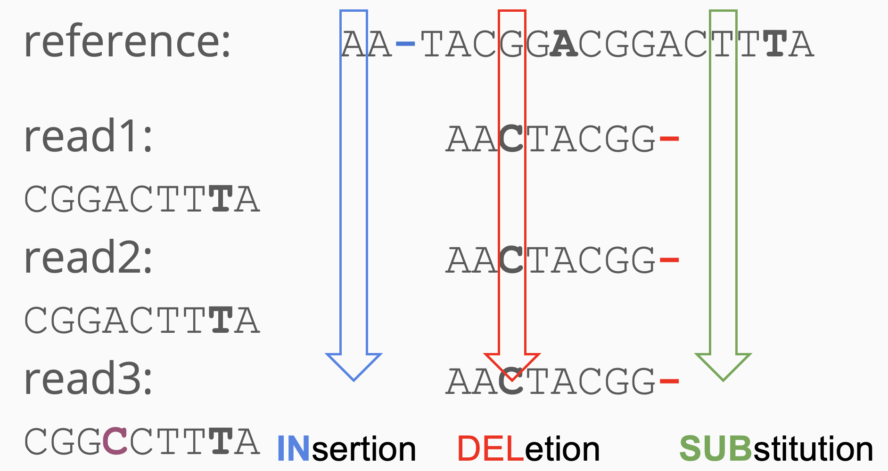

## Single Nucleotide Polymorphisms (SNPs)

\Large
- Most commonly studied type of variant
- Types of single nucleotide alterations:
  - **Variant** (SNV) - any single mutation
  - **Polymorphism** (SNP) - SNV observed in significant frequency in population (e.g. >1%)
- Typically base changes, e.g. A to C
- SNPs (usually) indicate shared ancestry
- May suggest disease mechanism

## Structural variation

\Large
- Deletions - sequence missing
- Insertions:
  - Novel - new sequence added
  - Mobile-element - copied/moved from elsewhere in genome
- Duplications:
  - Tandem - consecutive
  - Interspersed - non-consecutive
- Inversion - segment is reversed
- Translocation - segment moves

## Structural variation

\center
{height=80%}

## Genotyping

\Large
- **Genotype**: an individual’s variant(s)
- **Phenotype**: an individual’s physical form
- **De novo** variant calling/detection: given genomic reads and a reference, find all the variants
- **Genotyping**: examine individual for _a priori_ variants at known locations
  - Can use arrays (i.e. SNP Chip) or WGS/WES


## Human Genomic Variants

\Large
- Humans have diploid genome
  - i.e. 2 copies of each gene
- dbSNP - NCBI repository for SNPs
  - As of June 2021 (Build 155)
  - 3.3B submitted variants 
  - 1B annotated human SNPs
Every human has on average:
  - A variant every 1kb
  - 2-3 million SNPs

## Human Genomic Terminology

\Large
- **Allele**: sequence containing a variant
- **Homozygous variant**: both same allele
  - i.e. either same variant or same as reference
- **Heterozygous variant**: different alleles
  - i.e. one is variant, one is reference/different variant

\center
{width=70%}
https://www.genome.gov/genetics-glossary/heterozygous

## Human Genomic Terminology
\Large
For coding (exonic) variants:

- **Synonymous or sense**: variant does not change amino acid sequence
- **Non-synonymous or mis-sense**: variant causes amino acid change
- **Non-sense**: causes early termination of protein by introducing stop codon
- **Frameshift**: insertion or deletion causes complete recoding of downstream proteins

## Genomic Variant Terminology

\Large
- **Germline**: Inherited from parents
  - e.g. blue eyes, familial disease risk
- **Somatic**: Acquired during life
  - e.g. tumor vs normal tissue
- **Allele frequency**: how common is a given variant in some population, e.g.:
  - 1% of human population
  - 30% within people with some disease

## dbSNP - NCBI SNP Database


## Variants Smaller Than A Read

\Large
- Finding SNPs, indels almost a solved problem
- SNPs called are 95% accurate
  - i.e. with sufficient coverage
- Structural variants cause false positives
- Duplications, somatic mutations may cause 3 or more alleles to be observed

## SNP and indel density is non-random 


## Variants Larger Than A Read

\Large
- **Structural Variation (SV)**
- Two types:
  - Balanced - Do not change amount of DNA
  - Copy Number Variants (CNV) - Change amount of DNA
Scales:
  - Mini (hundreds of basepairs)
  - Macro (visible by a microscope) variants
  - Much harder to find (especially balanced)
Non-random: SV ‘hotspots’


## Haplotyping

\Large
- DNA recombines in large blocks
- SNPs in a block move around together
- Looking at the common SNPs in a block, reveals the ancestry information
- **Linkage Disequilibrium (LD)**: adjacent SNPs co-occur more often than expected
  - i.e. 2 SNPs are in LD with each other

## Haplotyping


## Methods for SNP Calling

\Large
1. **GATK (Genome Analysis Toolkit)**:
   - Developed by the Broad Institute, GATK is a widely used toolkit for variant discovery in high-throughput sequencing data.
   - It employs a best practices pipeline for variant calling, including base quality score recalibration, indel realignment, and variant quality score recalibration.
   - GATK offers various tools such as HaplotypeCaller and UnifiedGenotyper for variant calling from both exome and whole genome sequencing data.

2. **Mutect2**:
   - Mutect2 is part of the GATK toolkit and is specifically designed for somatic mutation calling, particularly in cancer genomes.
   - It utilizes a probabilistic model to differentiate true somatic mutations from sequencing artifacts.
   - Mutect2 can be applied to both exome and whole genome sequencing data to identify somatic variants.

## Methods for SNP Calling

\Large
3. **Samtools**:
   - Samtools is a suite of programs for interacting with high-throughput sequencing data in the SAM/BAM format.
   - It includes the mpileup command for generating pileup data, and bcftools for variant calling from the pileup data.
   - Samtools is efficient and widely used for variant calling in both exome and whole genome sequencing datasets.

4. **FreeBayes**:
   - FreeBayes is a Bayesian genetic variant detector designed to detect SNPs, indels, and complex polymorphisms in high-throughput sequencing data.
   - It utilizes a haplotype-based approach to increase sensitivity and specificity, particularly in the context of population-scale sequencing data.
   - FreeBayes can be used for variant calling in both exome and whole genome sequencing studies.

## Methods for SNP Calling

\Large
5. **VarScan**:
   - VarScan is a platform-independent tool for variant detection in massively parallel sequencing data.
   - It is optimized for calling germline variants, somatic mutations, and copy number alterations.
   - VarScan supports both exome and whole genome sequencing data and provides a range of options for variant calling and filtering.

6. **DeepVariant**:
   - DeepVariant is an end-to-end deep learning-based variant caller developed by Google.
   - It employs a convolutional neural network (CNN) architecture to call SNPs and indels with high accuracy.
   - DeepVariant is particularly effective in identifying complex variants and can be applied to both exome and whole genome sequencing data.


## Inconsistencies Among SNP Callers
Low concordance of variant-calling pipelines (O'Rawe, _Genome Med_, 2013)

\center
{height=80%}


## SAMtools Example
Multiple sample SNP calling:

```{bash, eval=F}	
## Load samtools
module load samtools

## mpileup
samtools mpileup -f genomefile.fa \ 
  myalignments.sorted.bam > myalignments.vcf
```

## GATK Example
```{bash, eval=F}
module load samtools
# Index reference
samtools faidx chrX_5MB.fa

module load gatk
# make sequence dictionary
gatk CreateSequenceDictionary -R chrX_5MB.fasta
# make .vcf file!
gatk HaplotypeCaller \
	-R chrX_5MB.fa -I proband_short_bwa.sorted.bam \
	-O proband_short.vcf
```

## VCF files


## Complete Variant Calling Pipeline  (Outdated!)
Our analysis pipeline consisted of the following:

- Align the FASTQ files to genome
- Convert SAM file to BAM, add read group info
- Filter the reads based on quality (BAMTools)
- Samtools to sort and index, and use Picard to mark duplicates
- GATK calibration, realignment, variant calling (HaplotypeCaller, Mutect2)
- Filter the called variants (GATK filtersnps and filterindels).
- Annotation of SNPs (snpEff, condel)
- Filter by frequency (thousand genomes, TCGA, etc.)
- Downstream analysis (rare variants, pedigree, pathway level, etc)		

## Genome Wide Association Studies (GWAS)

\Large
- Which SNPs are associated with a variable of interest?
  - e.g. disease, height
Does the frequency of any SNP differ between groups?
Associated SNPs have:
- Effect size - e.g. amount of increased risk
- p-value - precision of effect
- **Risk allele**: allele associated with increased or decreased probability of having a disease

## Genome Wide Association Studies (GWAS)


## Manhattan Plot

- In a **Manhattan plot**, each dot represents a genetic marker (SNP) on the x-axis, and its -log10(p-value) on the y-axis.
- The horizontal lines represent the significance threshold.
- Peaks represent regions where genetic variants are significantly associated with the trait or disease.

\center
{width=80%}

## Genome-Wide Significance Threshold

\Large
- The genome-wide significance threshold is a threshold used to determine if an association between a genetic variant and a trait is statistically significant.
- It takes into account the multiple comparisons problem arising from testing thousands or millions of genetic markers across the genome.

## Bonferroni Correction

\Large
- One method to establish the genome-wide significance threshold is the Bonferroni correction.
- The Bonferroni-corrected threshold is calculated by dividing the desired significance level (e.g., 0.05) by the number of tests performed.
- The most commonly accepted threshold is $$p < 5\times 10^{-8},$$ based on a Bonferroni correction for all independent common SNPs across the human genome

## False Discovery Rate (FDR)

\Large
- Another method to control for multiple comparisons is the False Discovery Rate (FDR).
- FDR controls the proportion of false positives among all significant results.
- It is less conservative than the Bonferroni correction and allows for a higher number of false positives while still controlling the overall error rate.

## Downstream Annotation and Analysis (Outdated!)

\large
Downstream Annotation Tools (old list):

- snpEff (http://snpeff.sourceforge.net/)
- Condel (http://bg.upf.edu/condel/home)
- SIFT http://sift.jcvi.org/
- Polyphen 2 http://genetics.bwh.harvard.edu/pph2/
- http://mutationassessor.org/ 
- Ensembl variant effect predictor (http://www.ensembl.org/info/docs/variation/vep/index.html)
- Thousand Genomes variant frequency (e.g. 1% threshold) and Exome Sequence Project variant frequency (e.g. 1%).


## Session info
\tiny
```{r session info}
sessionInfo()
```

