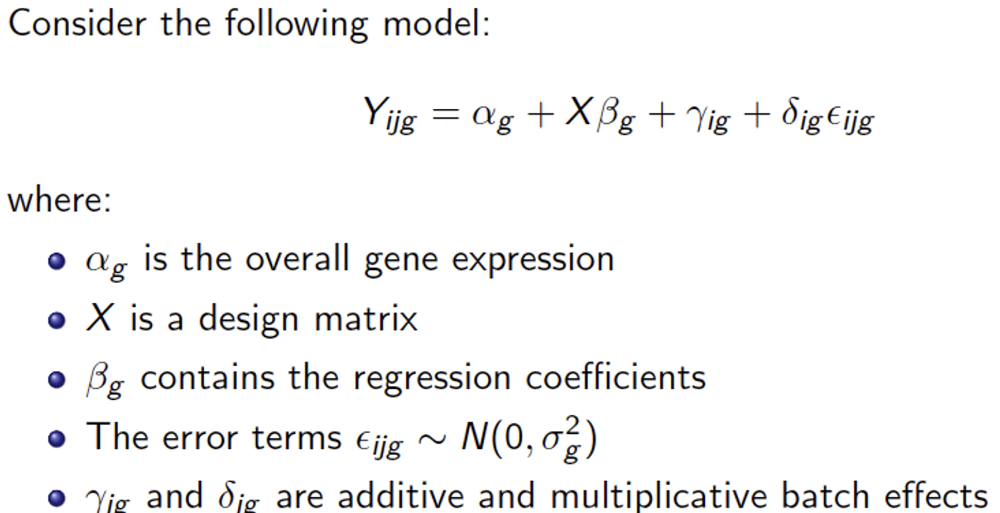

## Installing R Packages: 

Install the following tools: `Rsubread`, `Rsamtools`,  `edgeR`, `DESeq2`, `sva` `SummarizedExperiment`, `ComplexHeatmap`, `umap`, and the `TBSignatureProfiler`. We will also need help from the `tidyverse.`

```{r eval=F}
if (!requireNamespace("BiocManager", quietly = TRUE))
  install.packages("BiocManager")
BiocManager::install(c("Rsubread","Rsamtools","tidyverse",
  "SummarizedExperiment","edgeR","DESeq2","sva",
  "ComplexHeatmap", "TBSignatureProfiler","umap"))
```

## Installing and using the SCTK

```{r, eval=F}
install.packages("devtools")
devtools::install_github("wevanjohnson/singleCellTK")
library(singleCellTK)
singleCellTK()

### Example: open downstream_analysis/ 
### features_combined.txt and meta_data.txt
```


## Load Packages for RNA-Seq
We will be using the following packages for our RNA-seq lecture:
```{r, warning=FALSE, message=FALSE}
library(tidyverse) ## tools for data wranging
library(Rsubread) ## alignment and feature counts
library(Rsamtools) ## managing .sam and .bam files
library(SummarizedExperiment) ## managing counts data
library(edgeR) ## differential expression
library(DESeq2) ## differential expression
library(ComplexHeatmap) ## Heatmap visualization
library(TBSignatureProfiler) ## TB signature analysis
library(umap) ## dimenstion reduction and plotting data
```

## Objective

\Large
* Disclaimer: non-comprehensive introduction to RNA-sequencing 
* Introduce preprocessing steps
* Visualization 
* Analytical methods 
* Common software tools

## Steps to an RNA-seq Analysis (Literacy)

\Large
1. Preprocessing and QC:
    + Fasta and Fastq files
    + FastQC: good vs. bad examples
    + Visualization
2. Alignment
    + Obtaining genome sequence and annotation
    + Software: Bowtie, TopHat, STAR, Subread/Rsubread
3. Expression Quantification
    + Count reads hitting genes, etc
    + Approaches/software: HT-Seq, STAR, Cufflinks, RPKM FPKM or CPM, RSEM, edgeR, findOverlaps (GenomicRanges). featureCounts (Rsubread)

## Steps to an RNA-seq Analysis (Literacy)

\Large
4. More visualization
    + Heatmaps, boxplots, PCA, t-SNE, UMAP
5. Differential Expression
    + Batch correction
    + Overdispersion
    + General Workflow
    + Available tools: edgeR, DESeq, Limma/voom
    + Even more visualization!!

## Illumina Sequencing Workflow

\center
{height=85%}

## Sequencing Data Formats {.tabset}

Genome sequcencing data is often stored in one of two formats, FASTA and FASTQ text files. For example a FASTA files looks like the following: 


## FASTQ Files
We can also store confidence or quality scores using a FASTQ format: 


## FASTQ Encoding
In order to translate FASTQ quality scores: 


## FASTQ Probability
And now converting to confidence probabilities: 


## Preprocessing and QC using FASTQC
\Large 
[FastQC](http://www.bioinformatics.babraham.ac.uk/projects/fastqc/) provides a simple way to do QC checks on raw sequence data:  

* Import of data from BAM, SAM or FastQ files
* Quick overview and summary graphs and tables to quickly assess your data
* Export of results to an HTML based permanent report
* Offline operation to allow automated generation of reports without running the interactive application

## Preprocessing and QC using FASTQC

\Large 
To run FastQC you can launch the GUI app, or run form the command line: 

```{bash, eval=F}
rna_seq/FastQC/./fastqc \
  rna_seq/reads/R01_10_short500K.fq.gz
```

## FastQC Score Distribution
{width=49%}
{width=49%}


## FastQC Base and N Distribution
{width=49%}
{width=49%}

## Alignment to the Reference Genome
**Goal**: Find the genomic Location of origin for the sequencing read. Software: `Bowtie2`, `TopHat`, `STAR`, `Subread/Rsubread`, many others!


### Using Rsubread to do Alignment

\Large 
The following userguide will be helpful for you: 

http://bioinf.wehi.edu.au/subread-package/SubreadUsersGuide.pdf


## Indexing your genome

\Large 
Abraham Lincoln: "Give me six hours to chop down a tree and I will spend the first four sharpening the axe." 

(4 minutes indexing the genome, 2 minutes aligning the reads)

## Indexing your genome

\large 
Note that you will rarely do this for human alignment. You will usually download an existing index given to you by others who have already done this work. You will do this often if you are aligning microbial reads, e.g. MTB or some other organism for which others have not already made your index for you.

\normalsize
```{r, eval=F}
buildindex(basename="rna_seq/genome/ucsc.hg19.chr1_120-150M",
 reference="rna_seq/genome/ucsc.hg19.chr1_120-150M.fasta.gz")
```

\large
Took me ~0.2 minutes!

## Aligning your reads:  
Note that this outputs results in a .bam file and not a .sam file

```{r, eval=F, include=F}
align(index="rna_seq/genome/ucsc.hg19.chr1_120-150M",readfile1="rna_seq/reads/R01_10_short6M.fq.gz",output_file="rna_seq/alignments/R01_10_short.bam", nthreads=4)
```

```{r eval=F, include=F}
align(index="rna_seq/genome/ucsc.hg19.chr1_120-150M",readfile1="rna_seq/reads/R01_10_short500K.fq.gz",output_file="rna_seq/alignments/R01_10_short.bam", nthreads=4) 
```

```{r, eval=F}
align(index="rna_seq/genome/ucsc.hg19.chr1_120-150M",
      readfile1="rna_seq/reads/R01_10_short500K.fq.gz",
      output_file="rna_seq/alignments/R01_10_short.bam", 
      nthreads=4) 
```

My laptop is an Apple M2, which has 8 cores (used 4 cores), 24GB RAM: 

  - Took 15.7 minutes to align ~60M reads to the 30M bases
  - Took 0.7 minutes to align ~6.5M reads to the 30M bases
  - Took 0.3 minutes to align ~500K reads to the 30M bases

## Aligned Sequencing Data Formats (SAM and BAM)
Note that Rsubread outputs a .bam file (bam = binary alignment map) and not a .sam file (sam = sequence alignment map). Here is some information about a .sam file: https://en.wikipedia.org/wiki/SAM_(file_format)


## Aligned Sequencing Data Formats (SAM and BAM)
To convert .sam to .bam or vice versa, a package called Rsamtools. Using Rsamtools, you can convert bam to sam as follows:

```{r, eval=F}
asSam("rna_seq/alignments/R01_10_short.bam", 
      overwrite=T) 

# To convert to bam:
#asBam("rna_seq/alignments/R01_10_short.bam") 
```


## Feature counts
\Large
Now we can count reads hitting genes. Approaches/software: 

* HT-Seq
* STAR
* Cufflinks
* RPKM FPKM or CPM
* RSEM
* edgeR
* findOverlaps (GenomicRanges)
* featureCounts (Rsubread)

## Feature counts
\center
{height=85%}

## Feature counts

```{r, eval=FALSE}
fCountsList = featureCounts(
  "rna_seq/alignments/R01_10_short.bam",
  annot.ext="rna_seq_files/genome/genes.chr1_120-150M.gtf",
  isGTFAnnotationFile=TRUE)

featureCounts = cbind(fCountsList$annotation[,1], 
                      fCountsList$counts)

write.table(featureCounts, 
    "rna_seq/alignments/R01_10_short.features.txt", 
    sep="\t", col.names=FALSE, row.names=FALSE, quote=FALSE)
```


## SCTK
\Large
Use the Single Cell Toolkit (SCTK) to analyze your RNA-seq data!

* Inputs: RNA-seq, Nanostring, Proteomic, immunological assay data
* Interactive analyses and visualization of data
* Save results, figures, etc
* Sophisticated data structures
* R/Bioconductor package

## SCTK


## SCTK


## Installing and using the SCTK

```{r, eval=F}
install.packages("devtools")
devtools::install_github("wevanjohnson/singleCellTK")
library(singleCellTK)
singleCellTK()

### Example: open downstream_analysis/ 
### features_combined.txt and meta_data.txt
```

## Data Structures
\Large
A data structure is a particular way of organizing data in a computer so that it can be used effectively. The idea is to reduce the space and time complexities of different tasks.

## Data Structures
\Large
Data structures in R programming are tools for holding multiple values, variables, and sometimes functions

**Please think very carefully about the way you manage and store your data!** This can make your life much easier and make your code and data cleaner and more portable!

## Data Structures
\Large
There are advanced R data structures, __S3__ and __S4__ class objects, that can facilitate object orientated programming. One useful example of an S4 class data structure is the __SummarizedExperiment__ object. 

## Data Structures
\center
{height=85%}


## Normalization
\Large
Need to normalize data because of:

* Sequencing depth difference in each RNA sample
* RNA composition differences
* Highly expressed genes can consume a substantial proportion of RNA-Seq reads, causing other genes to be under-sampled
* Different methods
    + Log counts
    + Counts per million (CPM and logCPM; RPKM, FPKM)
    + Trimmed mean of M-values (edgeR/limma)
    + Median of Ratios method (DESeq)

## Normalization   


## Problem of overdispersion: 
\Large
Alignment and feature counting result in discrete count data (i.e. the number of reads to each gene). A first thought might be to use a Poisson distribution to model the counts. However, the Poisson makes a strict mean-variance assumption (i.e. they are the same). Studies have demonstrated that a negative binomial fits data better. 

## Problem of overdispersion: 
\center
{height=90%}


## Batch effects 
\Large
>Batch Effect: Non-biological variation due to differences in batches of data that confound the relationships between covariates of interest. 

Batch effects are caused by differences in:

* Gene expression profiling platform
* Lab protocol or experimenter
* Time of day or processing
* Atmospheric ozone level (Rhodes et al. 2004)

## Batch Effect Example #1: Nirtic Oxide
\Large
This Example is an oligonucleotide microarray (Affymetrix HG-U133A) experiment on human lung fibroblast cells (IMR90) designed to reveal whether exposing mammalian cells to nitric oxide (NO) stabilizes mRNAs. 

Microarray data were collected at baseline (0 h, just before transcription inhibition) and at the end of the experiment (after 7.5 h) for both the control and the NO-treated group. 


## Batch Effect Example #1: Nirtic Oxide


## Batch Effect Example #2: Control Gene Expression
{height=90%}

## Batch Effect Example #3: Proteomic markers
**Proteomic markers to predict endometriosis (39 total)**:

\Large
Single peptide predictors of disease (AUC): 0.82, 0.76, 0.74, 0.74, 0.70 (+12 more >0.6)

Single peptide predictors of batch (AUC): 0.99, 0.94, 0.91, 0.86, 0.86, 0.84, 0.84, 0.84, 0.83, 0.82 (+7 more >0.6)

Predict batch better than disease!

## ComBat Batch Adjustment


## ComBat Batch Adjustment


## BatchQC Example
We can use BatchQC to evaluate and correct for batch effects:
```{r, eval=F}
if (!require("BiocManager", quietly = TRUE))
    install.packages("BiocManager")
BiocManager::install("BatchQC")

library(BatchQC)
BatchQC()
```


## Visualization and Dimension reduction

Using an example dataset from: [Verma, et al., 2018](https://bmcinfectdis.biomedcentral.com/articles/10.1186/s12879-018-3127-4)
```{r}
## read in data
counts <- read.table(
  "rna_seq/downstream_analysis/features_combined.txt", 
  sep="\t", header=T, row.names=1)
meta_data <- read.table(
  "rna_seq/downstream_analysis/meta_data.txt",
  sep="\t", header=T, row.names=1)
group <- meta_data$Disease
```

## Visualization and dimension reduction
```{r}
## Make SummarizedExperiment
se_hivtb <- SummarizedExperiment(assays=list(counts=counts),
                     colData = meta_data)

## Make log counts, counts per million (cpm), logcpm
se_hivtb <- mkAssay(se_hivtb, log = TRUE, 
                     counts_to_CPM = TRUE)
assays(se_hivtb)
```

## Principal Components Analysis (PCA)

```{r, eval=F}
set.seed(1)
pca_out <- prcomp(t(assay(se_hivtb,"log_counts_cpm")))
  
pca_plot <- as.data.frame(pca_out$x)
pca_plot$Disease <- as.factor(se_hivtb$Disease)

g <- pca_plot %>% ggplot(aes(x=PC1, y=PC2, color=Disease)) +
  geom_point(size=1.5) + xlab("PCA1") + ylab("PCA2") +
  theme(plot.title = element_text(hjust = 0.5)) +
  ggtitle("PCA Plot")

plot(g)
```

## Principal Components Analysis (PCA)

```{r, echo=F, fig.height=4, fig.align='center'}
set.seed(1)
pca_out <- prcomp(t(assay(se_hivtb,"log_counts_cpm")))
  
pca_plot <- as.data.frame(pca_out$x)
pca_plot$Disease <- as.factor(se_hivtb$Disease)

g <- pca_plot %>% ggplot(aes(x=PC1, y=PC2, color=Disease)) +
  geom_point(size=1.5) + xlab("PCA1") + ylab("PCA2") +
  theme(plot.title = element_text(hjust = 0.5)) +
  ggtitle("PCA Plot")

plot(g)
```


## Uniform Manifold Approximation and Projection (UMAP)
\Large
For more on UMAP, please visit the following excellent tutorial: 
https://pair-code.github.io/understanding-umap/

## Uniform Manifold Approximation and Projection (UMAP)

```{r, eval=F}
set.seed(1)
umap_out <- umap(t(assay(se_hivtb,"log_counts_cpm")))

umap_plot <- as.data.frame(umap_out$layout)
umap_plot$Disease <- as.factor(se_hivtb$Disease)

g <- umap_plot %>% ggplot(aes(x=V1, y=V2, color=Disease)) +
  geom_point(size=1.5) + xlab("UMAP1") + ylab("UMAP2") +
  theme(plot.title = element_text(hjust = 0.5)) +
  ggtitle("UMAP Plot")

plot(g)
```


## Uniform Manifold Approximation and Projection (UMAP)

```{r, echo=F,fig.height=4, fig.align='center'}
set.seed(1)
umap_out <- umap(t(assay(se_hivtb,"log_counts_cpm")))

umap_plot <- as.data.frame(umap_out$layout)
umap_plot$Disease <- as.factor(se_hivtb$Disease)

g <- umap_plot %>% ggplot(aes(x=V1, y=V2, color=Disease)) +
  geom_point(size=1.5) + xlab("UMAP1") + ylab("UMAP2") +
  theme(plot.title = element_text(hjust = 0.5)) +
  ggtitle("UMAP Plot")

plot(g)
```


## Differential Expression {.tabset}


## EdgeR Example
Implements statistical methods for DE analysis based on the negative binomial model:

```{r}
#Gene Filtering
counts<-counts[which(rowSums(counts)>1),] 
#Computes library size
dge <- DGEList(counts=counts, group=group) 
#TMM normalization
dge <- calcNormFactors(dge) 
# Design matrix
design<-model.matrix(~Disease, data=meta_data)
#Estimates common, trended and tagwise dispersion
dge<-estimateDisp(counts,design) 
```

## EdgeR Example
\Large
In negative binomial models, each gene is given a dispersion parameter.  Dispersions control the variances of the gene counts and underestimation will lead to false discovery and overestimation may lead to a lower rate of true discovery.

## EdgeR Example

```{r}
# Neg Bin GLM with the dispersion estimates
fit<-glmFit(counts,design, 
            dispersion=dge$tagwise.dispersion) 
# Performs likelihood ratio test
# Compares full versus reduced model
lrt<-glmLRT(fit, coef=2) 
```


## EdgeR Example

\small
```{r}
# Prints the top results
topTags(lrt)
```

## EdgeR Example
```{r}
# Perform quasi-likelihood F-tests
## Replace the chisquare approximation to the likelihood 
## ratio statistic with a quasi-likelihood F-test, 
## more control of error rate
fit<-glmQLFit(counts, design, 
        dispersion=dge$tagwise.dispersion) 
## use for small dataset, uncertainty in estimating 
## control when number of replicates is small  
## dispersion for each gene, more robust and reliable 
qlf<-glmQLFTest(fit, coef=2)
```

## EdgeR Example
\small
```{r}
# Prints the top results
topTags(qlf)
```

## EdgeR Example
\Large
```{r}
#For visualization, heatmaps/PCA
Logcpm<-cpm(counts,log=TRUE)
```

## DESeq2 Example
```{r, include=F}
meta_data$Disease = as.factor(meta_data$Disease)
```

```{r}
#colData is a data frame of demographic/phenotypic data
dds <- DESeqDataSetFromMatrix(countData = counts, 
                              colData=meta_data, 
                              design=~Disease)
#Gene Filtering
dds<-dds[rowSums(counts(dds))>1,] 
```

## DESeq2 Example
\scriptsize
```{r}
#Performs estimation of size factors,
#dispersion, and negative binomial GLM fitting
dds<-DESeq(dds) 
```

## DESeq2 Example
\scriptsize
```{r}
res <- results(dds)[order(results(dds)[,6]),]
res[1:10,]
``` 

## Heatmap of DEGs
```{r, eval=F}
# Make a Heatmap of DEGs
mat = as.matrix(assay(se_hivtb,"log_counts_cpm")
                )[order(results(dds)[,6])[1:100],] 
                # Using first 1000 genes to simplify
mat = t(scale(t(mat)))
df=data.frame(Disease=colData(se_hivtb)$Disease) 
ha = HeatmapAnnotation(df = df, 
                       col = list(Disease=c(
                         "tb_hiv"="Red",
                         "hiv_only"="Blue",
                         "tb_hiv_art"="Green")))
Heatmap(mat,show_row_names=F, show_column_names = F, 
        top_annotation = ha)
```

## Heatmap of DEGs

```{r, echo=F, out.height='80%',fig.align='center'}
# Make a Heatmap of DEGs
mat = as.matrix(assay(se_hivtb,"log_counts_cpm")
                )[order(results(dds)[,6])[1:100],] 
                # Using first 1000 genes to simplify
mat = t(scale(t(mat)))
df=data.frame(Disease=colData(se_hivtb)$Disease) 
ha = HeatmapAnnotation(df = df, 
                       col = list(Disease=c(
                         "tb_hiv"="Red",
                         "hiv_only"="Blue",
                         "tb_hiv_art"="Green")))
Heatmap(mat,show_row_names=F,
        show_column_names = F, 
        top_annotation = ha)
```


## Limma Example
\Large
* Most similar to microarray data flow
* Reads counts are converted to log2 counts per million (logCPM) and the mean-variance relationship is modeled with precision weights (voom transform)

## Limma Example
```{r}
#From edgeR, Computes library size
dge <- DGEList(counts=counts, group=group) 
#Gene Filtering
counts<-counts[which(rowSums(cpm(counts))>1),] 
dge <- calcNormFactors(dge) #TMM normalization
```

## Limma Example
```{r}
design<-model.matrix(~group)
#voom transform to calculate weights to 
#eliminate mean-variance relationship
v<-voom(dge, design)
#use usual limma pipelines
fit<-lmFit(v,design)
fit<-eBayes(fit)
```

## Limma Example
\scriptsize
```{r}
topTable(fit, coef=ncol(design))
```

## Pathway analysis
\Large
After finding DEGs, look for correlated genes/networks and enriched pathway sets in the gene set using: 

* Weighted gene coexpression network analysis (WGCNA)
* GSEA, GSVA, EnrichR, many more!!
* Qiagen Ingenuity Pathway Analysis (IPA)

## Pathway analysis


## Pathway analysis
\center
{height=85%}

## TBSignatureProfiler Analysis
The TBSignatureProfiler was developed in the Johnson Lab in 2021 to profile new and existing TB gene expression signatures:

[https://bmcinfectdis.biomedcentral.com/articles/10.1186/s12879-020-05598-z](https://bmcinfectdis.biomedcentral.com/articles/10.1186/s12879-020-05598-z)

## TBSignatureProfiler Analysis
```{r, message=FALSE, results='hide'}
se_hivtb_2 <- se_hivtb[,
      colData(se_hivtb)$Disease != "tb_hiv_art"]
TBsigs <- TBsignatures[-12] 
ssgsea_res <- runTBsigProfiler(se_hivtb_2, 
                  useAssay = "log_counts_cpm",
                  signatures = TBsigs,
                  algorithm = "ssGSEA",
                  combineSigAndAlgorithm = TRUE,
                  parallel.sz = 1)
```

## Signature Heatmap:
```{r, eval=F}
# Colors for gradient
signatureHeatmap(ssgsea_res, 
        name = "Heatmap of Signatures (ssGSEA)", 
        signatureColNames = names(TBsigs),
        annotationColNames = c("Disease"),
        scale = TRUE,
        split_heatmap = "none",
        showColumnNames = FALSE)
```

## Signature Heatmap:
```{r, echo=F, fig.height=6.5}
# Colors for gradient
signatureHeatmap(ssgsea_res, 
        name = "Heatmap of Signatures (ssGSEA)", 
        signatureColNames = names(TBsigs),
        annotationColNames = c("Disease"),
        scale = TRUE,
        split_heatmap = "none",
        showColumnNames = FALSE)
```

## Signature Boxplots
```{r, warning=F, fig.height=5}
signatureBoxplot(ssgsea_res, name="ssGSEA", 
          signatureColNames = names(TBsigs)[c(62,77)],
          annotationColName = c("Disease"))
```

## Session info
\tiny
```{r session info}
sessionInfo()
```
